# Инструкция по подключения GitHab и Git к PyCharm

**1. Открыть PyCharm**

**2. Что бы подключить наш удалённый репозиторий нужно выбрать VCS | Get from Version Control.**

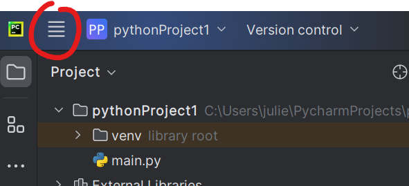

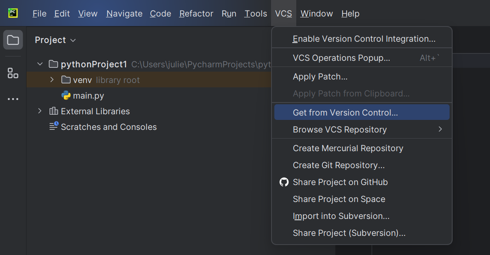

**3. Далее появится вот такое окно**

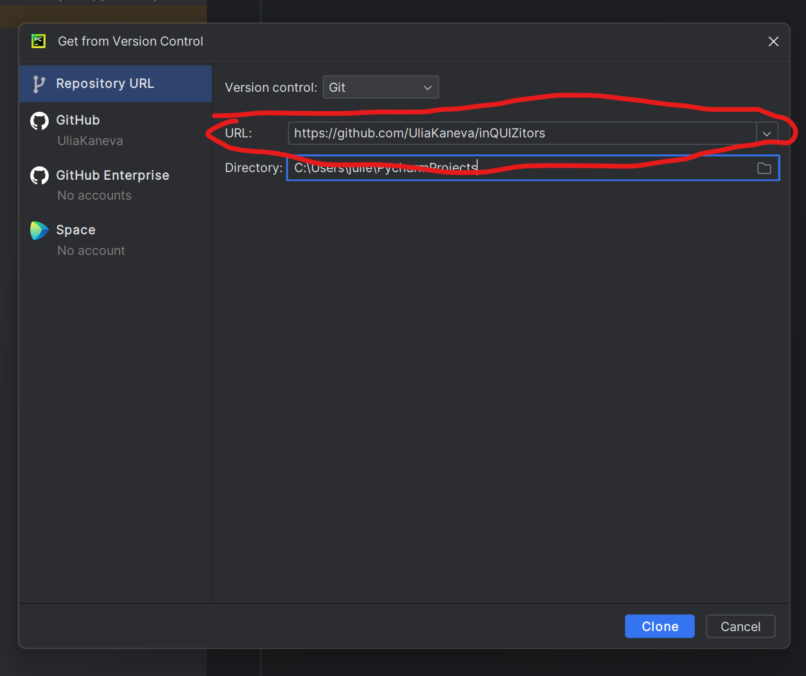

В поле URL нужно вставить эту ссылку:

```
https://github.com/UliaKaneva/inQUIZitors
```

В поле Directory нужно прописать маршрут до папки с проектом, но оно по умолчанию выбирает проект в котором вы начали,
поэтому можно не беспокоится.

И нажать Clone.

**4. Далее вас попросят ввести ваши логин и пароль от GitHub, поэтому прошу вас вспомнить их.**

# Использование Git через PyCharm.
Ура мы подключили наш удалённый репозиторий! Теперь пора разобраться как им пользоваться.

## Разберёмся с обозначением файлов в PyCharm
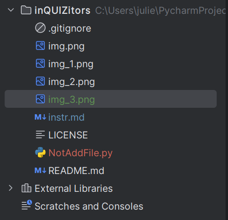

Как вы видите всего 4 цвета, сейчас разберёмся с каждым:

* Красный - означает, что ваш файл не отслеживается гит, и если это требуется его нужно добавить. Если вы создаёте файл,
то у вас высветится такое окно:

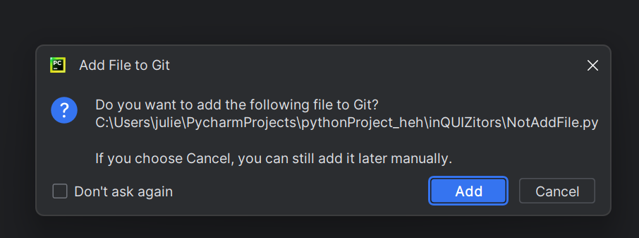

Если этот файл нужно будет заливать в репозиторий, то смело жмите "Add"
Также файл можно добавить в ручную: правой кнопкой мыши по файлу > Git > +Add

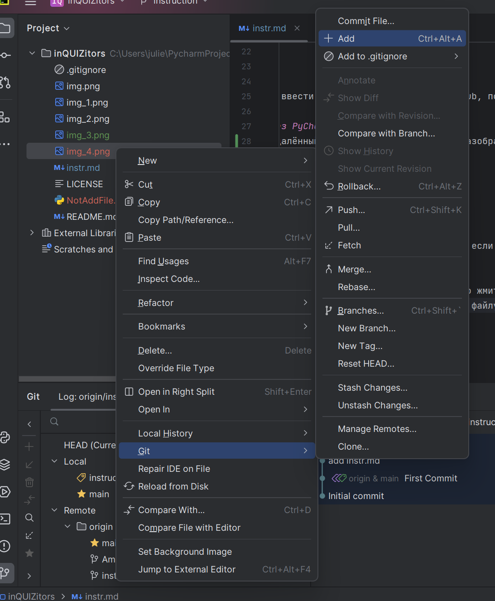

* Зелёный - означает, что файл отслеживается гит, но в нём есть незафиксированные изменения (незакомеченные), а ещё
этот файл есть только в локальном репозитории.
* Голубой - означает, что файл отслеживается гит, но в нём есть незакомиченные изменения, но в отличие от зелёного
предыдущая версия файла есть на удалённом репозитории.
* Белый - означает, что последняя версия файла закомиченна и изменеий с того времени нет.

## 2. Теперь пришло время разобраться с функциями Git через PyCharm
1. Первая функция это **Commit**.

Закомитить - это сохранить последние изменения на локальном репозитории. Сейчас покажу как это сделать.

Слева сверху есть такая кнопочка 

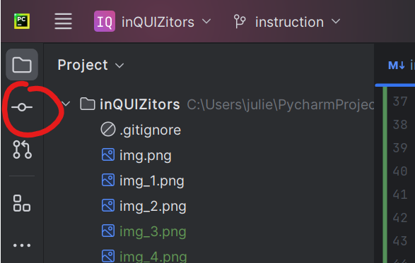

Кликаем на неё. У нас появляется такое окошечко

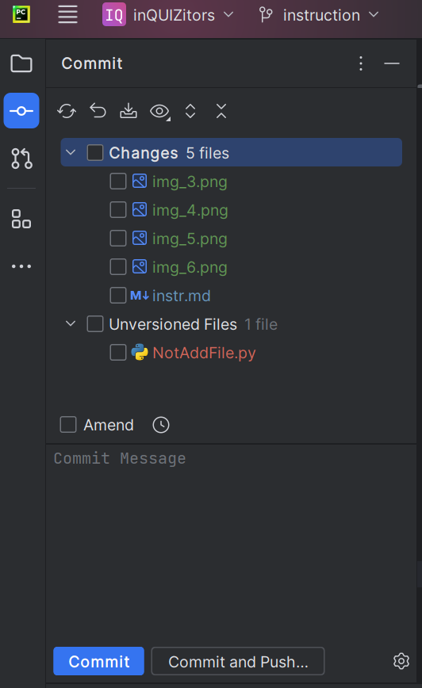 

Тут мы выбираем файлы, которые хотим закомитить. Обратите внимание, файл, который мы не добавили, попал в категорию
неотслеживаемых файлов.

**Не забываем оставлять краткое, но точное описание коммита, это важно!**

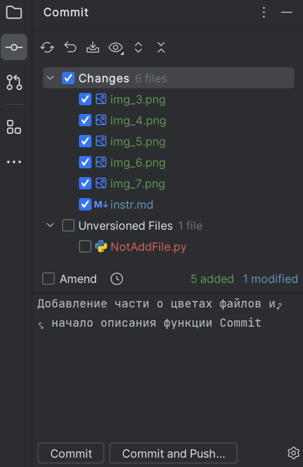

Теперь смело нажимаем кнопку **Commit**.

2. Теперь пора познакомиться с функцией **Push**.
Функция Push отправляет, все коммиты на удалённый репозиторий.

Для того чтобы запушить нажимаем кнопку сверху с названием нашей ветки. В моём случае это instruction.

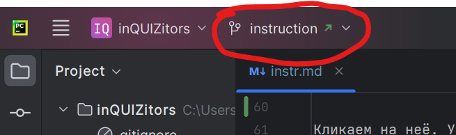

Появляется такое окно 

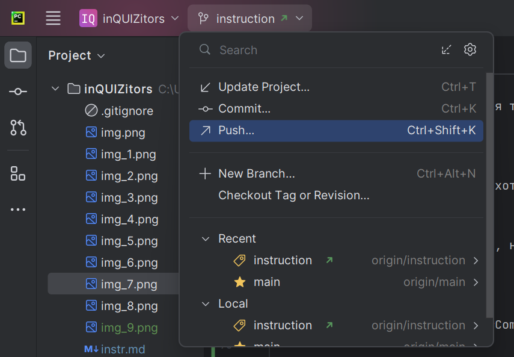

Нажимаем кнопку Push. Появится такое окно

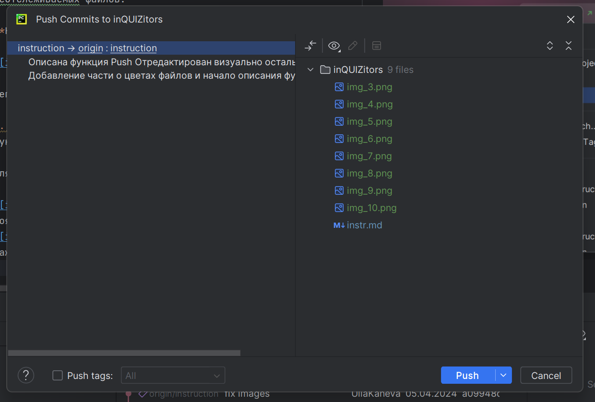

Проверяем все комиты и файлы и нажимаем **Push**.