# Инструкция по подключения GitHab и Git к PyCharm

**1. Открыть PyCharm**

**2. Что бы подключить наш удалённый репозиторий нужно выбрать VCS | Get from Version Control.**

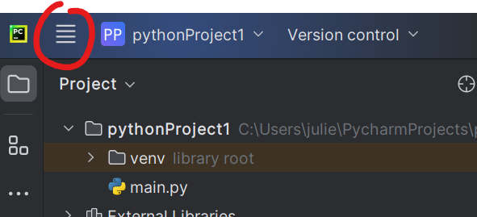

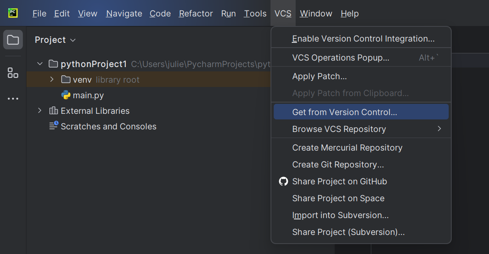

**3. Далее появится вот такое окно**

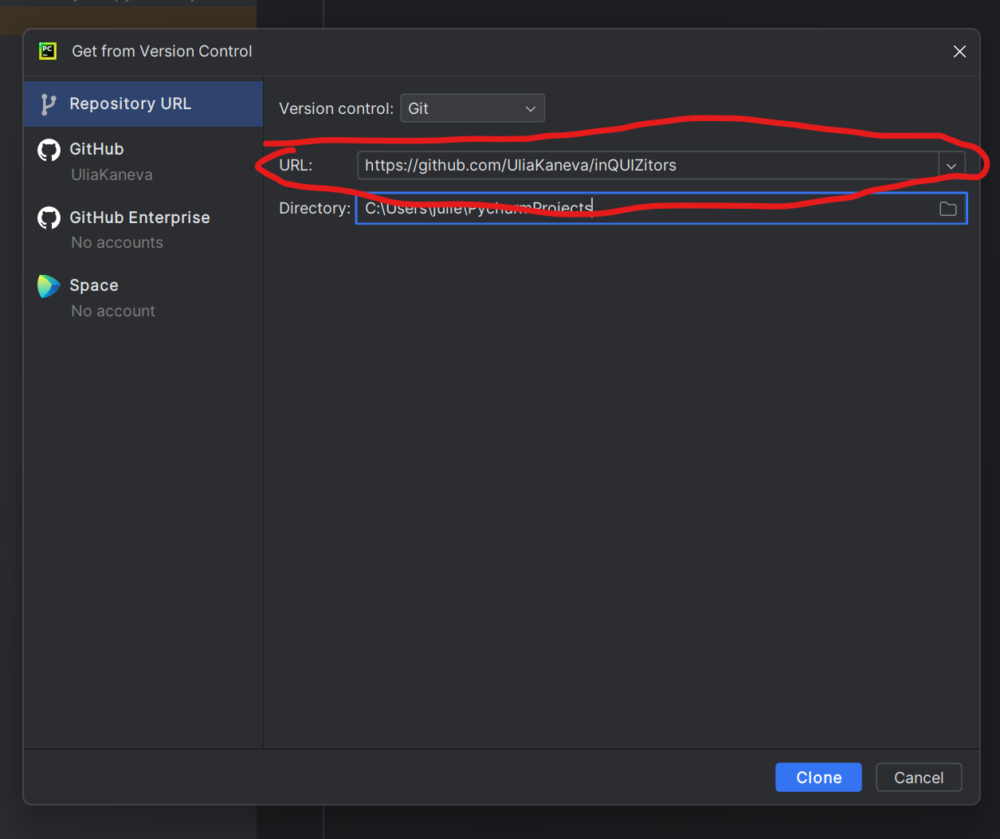

В поле URL нужно вставить эту ссылку:

```
https://github.com/UliaKaneva/inQUIZitors
```

В поле Directory нужно прописать маршрут до папки с проектом, но оно по умолчанию выбирает проект в котором вы начали,
поэтому можно не беспокоится.

И нажать Clone.

**4. Далее вас попросят ввести ваши логин и пароль от GitHub, поэтому прошу вас вспомнить их.**

# Использование Git через PyCharm.
Ура мы подключили наш удалённый репозиторий! Теперь пора разобраться как им пользоваться.

## Разберёмся с обозначением файлов в PyCharm
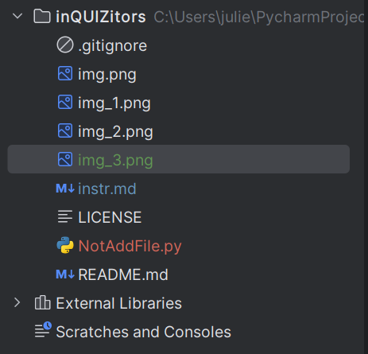

Как вы видите всего 4 цвета, сейчас разберёмся с каждым:

* Красный - означает, что ваш файл не отслеживается гит, и если это требуется его нужно добавить. Если вы создаёте файл,
то у вас высветится такое окно:

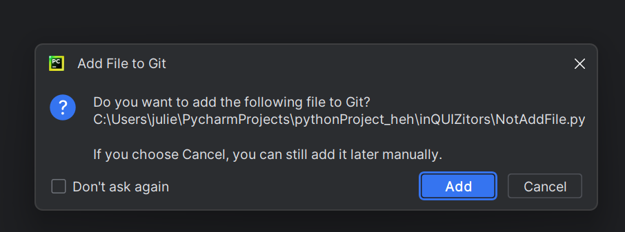

Если этот файл нужно будет заливать в репозиторий, то смело жмите "Add"
Также файл можно добавить в ручную: правой кнопкой мыши по файлу > Git > +Add

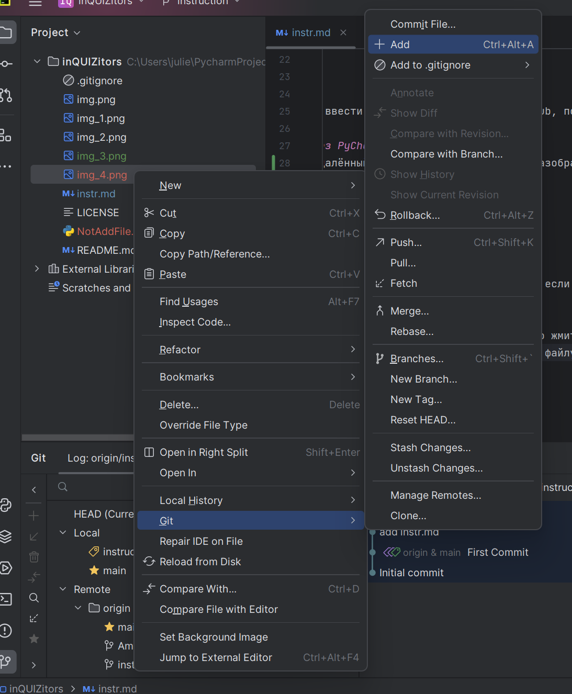

* Зелёный - означает, что файл отслеживается гит, но в нём есть незафиксированные изменения (незакомеченные), а ещё
этот файл есть только в локальном репозитории.
* Голубой - означает, что файл отслеживается гит, но в нём есть незакомиченные изменения, но в отличие от зелёного
предыдущая версия файла есть на удалённом репозитории.
* Белый - означает, что последняя версия файла закомиченна и изменеий с того времени нет.

## 2. Теперь пришло время разобраться с функциями Git через PyCharm
1. Сначала научимся создавать ветки от других веток.

Первым делом стоит создать свою ветку, в которой вы будете выполнять свою задачу, чтобы случайно не испортить главную ветку.

Для этого нажимаем на кнопку сверху с названием ветки в которой вы сейчас находитесь. Чаще всего это будет ветка **main**,
но у меня это ветка instruction:

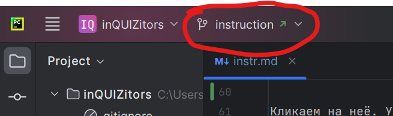

После нажатия появится такое окно, там выбираем ветку, от которой мы создадим новую, на картинке это main. Кликаем на неё
и в появившемся окне нажимаем **New Brunch from "Название ветки, которую вы выбрали"**

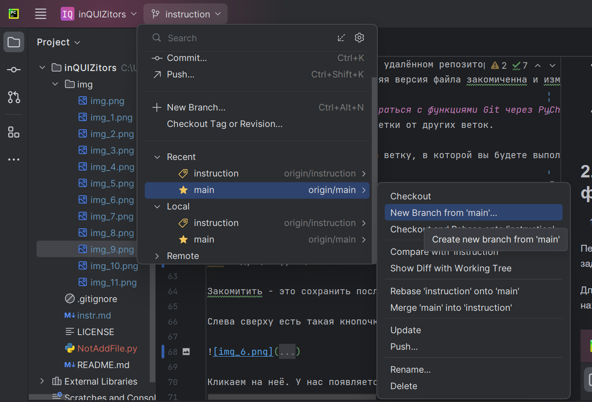

Далее появится окно, в котором нужно будет ввести название ветки, например **Реализация_регистрации_Канева_Юлия**
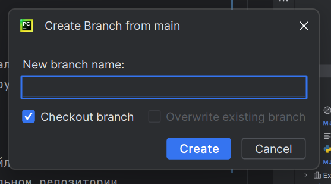

Галочка отвечает за то, чтобы вы сразу оказались в созданной ветке.
2. Следующая функция это **Commit**.

Закомитить - это сохранить последние изменения на локальном репозитории. Сейчас покажу как это сделать.

Слева сверху есть такая кнопочка 

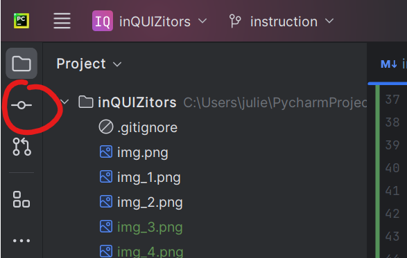

Кликаем на неё. У нас появляется такое окошечко

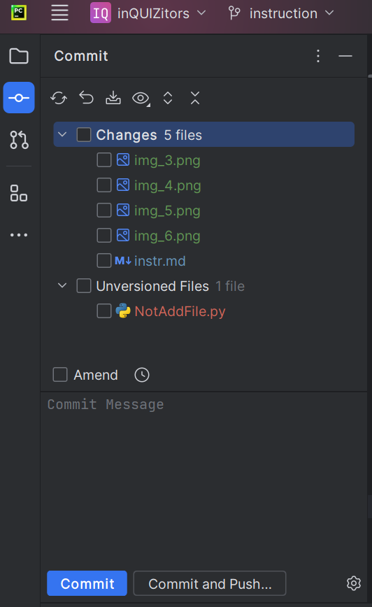 

Тут мы выбираем файлы, которые хотим закомитить. Обратите внимание, файл, который мы не добавили, попал в категорию
неотслеживаемых файлов.

**Не забываем оставлять краткое, но точное описание коммита, это важно!**

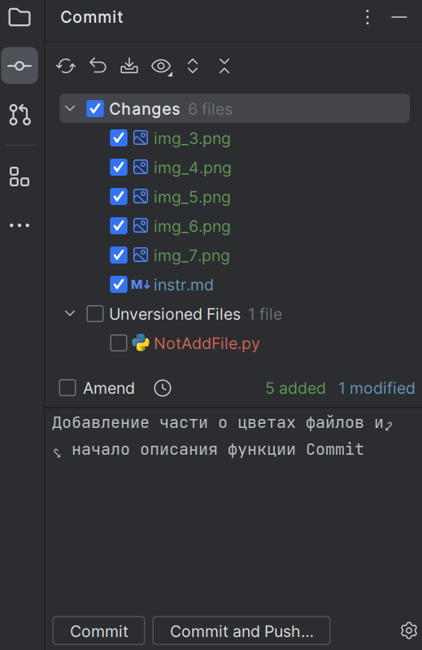

Теперь смело нажимаем кнопку **Commit**.

3. Теперь пора познакомиться с функцией **Push**.
Функция Push отправляет, все коммиты на удалённый репозиторий.

Для того чтобы запушить нажимаем кнопку сверху с названием нашей ветки. В моём случае это instruction.


Появляется такое окно 

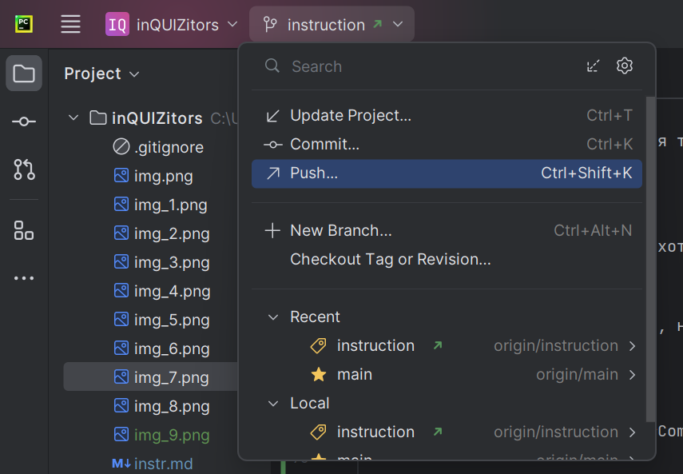

Нажимаем кнопку Push. Появится такое окно

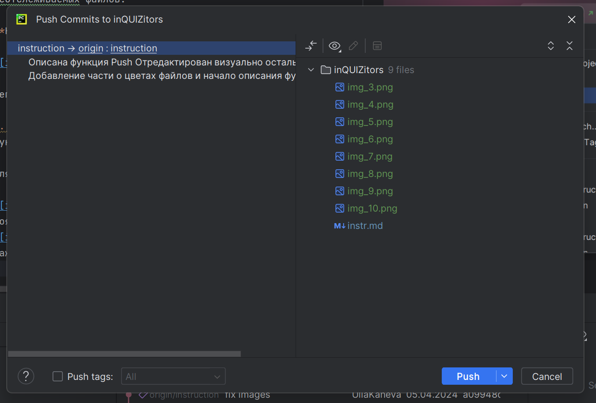

Проверяем все комиты и файлы и нажимаем **Push**.

4. Также может произойти, что вы работали на нескольких устройствах, и Вам сейчас нужны все последние изменения вашей ветки. Для этого
нужно сделать **Update** для этого нажимаем 


Далее выбираем нашу ветку и кликаем на неё и нажимаем **Update**. 

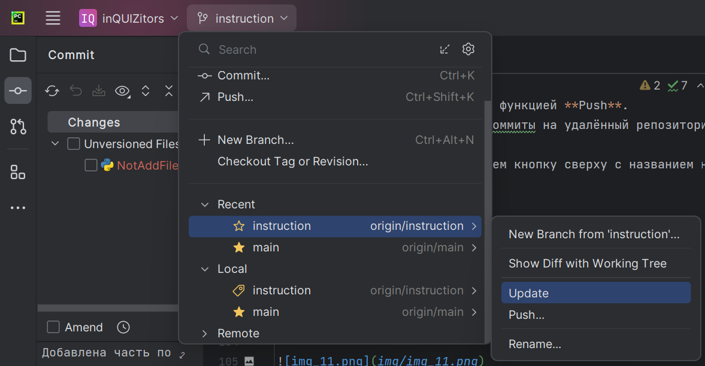

5. Осталось последнее, но не по значению **Pull Requests**

Pull Request - Это функция соединения веток, с предварительной проверкой, от других участников команды.
Для чего нужно проверка от других, и вообще, зачем соединять ветки?
* Во-первых, ветки нужно соединять, чтобы проект был единым целым.
* Во-вторых, предварительная проверка нужна, чтобы исключить, возможность конфликтов, вдруг какие-то функции между собой,
не стыкуются.
* В-третьих, чтобы не было ошибок с оформлением.

[Тут](https://youtu.be/G_HKJJLozUc) подробно рассказано, что, зачем и как.

Приступим к инструкции.

Если вы вдруг уверены, что закончили работу, то время Pull Requests пришло.
Для начала нажмём кнопочку слева сверху

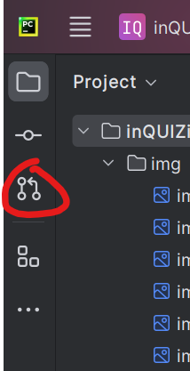

Появится такое окно. В нём нажимаем плюсик.
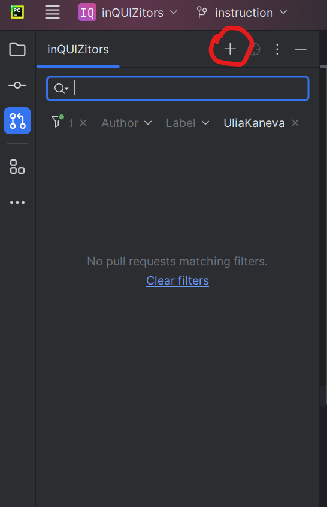

Появится такое окошко
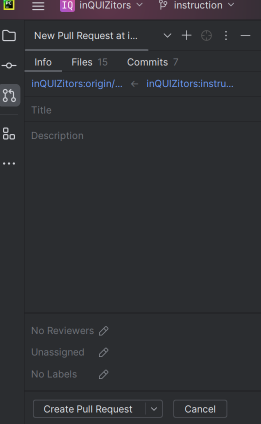

В графе Title пишем название, а в графе Description подробно пишем, что было сделано. Нажимаем Create Pull Request.
После ждём пока не получим одобрения.
# Вот и всё. А теперь бегом работать.